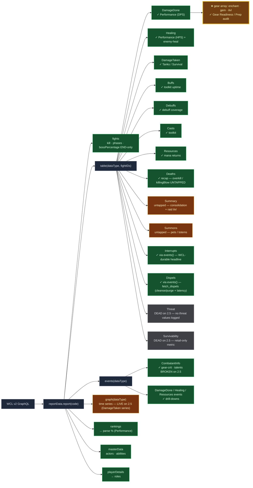

# WCL v2 API surface — what we have access to (live recon)

**Purpose.** A map of *everything* the WCL v2 GraphQL API exposes for our reports, surveyed live
against report `J4Ba1j6VAPDmqCFp` (2026-06-11), and graded against the Raider-Score framework. We had
built only the queries our planned pillars needed; this is the systematic sweep of the edges.

**Method.** Ran `table(dataType: X)` for every `X`, then deep-probed the high-value returns. "Live"
= confirmed returning real data on the 2.5 Anniversary client.

---

## Visual map

**Recon complete — every dataType probed.** Green = we use it · Amber = available & untapped (some only
via `events()`) · Grey = genuinely unavailable on the 2.5 client · Gold = the standout find.



---

## table() dataType sweep — all return a shape, but content varies

| dataType | Returns | We use it? | Untapped value |
|---|---|---|---|
| **Summary** | totalTime, **itemLevel**, **composition**, damageDone, healingDone, damageTaken, deathEvents, playerDetails | ✗ | One-query overview — consolidation/efficiency; raid avg ilvl |
| **Buffs** | auras[] (uptime/bands) | ✓ (toolkit uptimes) | — |
| **Casts** | entries[] incl. **gear, talents**, abilities, targets | ✓ (toolkit) | gear/talents ride along |
| **DamageDone** | entries[] incl. **gear[], talents[]**, abilities, targets | ✓ (DPS + gear audit) | **✓ SHIPPED — `fetch_gear_audit` → `WEEK_DATA.gearAudit` (enchant/gem/ilvl Prep audit; see below)** |
| **DamageTaken** | entries[] incl. sources, overheal, abilities | ✓ (tanks) | per-source breakdown for non-tanks. ⚠ DamageTaken **events** also carry **`unmitigatedAmount`** (raw pre-mitigation incoming) + **`mitigated`** (live-verified 2026-06-14) — powers the tank **CD coverage value** (unmitigated faced during a defensive aura window ÷ baseline unmit DTPS). Events carry **no `hitPoints`** (null) — can't read tank HP-at-a-timestamp from them |
| **Deaths** | entries[] incl. **overkill, killingBlow, deathWindow, events** | ✓ (recap) | overkill / killingBlow depth for Survival. ⚠ recap `events[]` embed an **`ability` OBJECT** (`{name, guid, abilityIcon}`), NOT the flat `abilityGameID`/`type` that DamageDone/DamageTaken events carry — read `ev.ability.name` (see note below) |
| **Debuffs** | auras[] (uptime/bands) | ✓ (debuff coverage) | — |
| **Healing** | entries[] incl. overheal, abilities, targets | ✓ (healers) | enemy-healing (proved MS value) |
| **Resources** | resources[] | ✓ (mana returns) | self-sustain view |
| **Summons** | entries[] (pets/totems) | ✗ | pet/totem uptime |
| **Dispels** | entries (nested) — **null via table(); use events()** | ✓ (events()) | ✓ SHIPPED — `fetch_dispels` (+ `_dispel_latency`) → `WEEK_DATA.dispels` (cleanse/purge + reaction latency) |
| **Interrupts** | entries (nested) — **null via table(); use events()** | ✓ (events()) | ✓ SHIPPED — `fetch_interrupts` → `WEEK_DATA.interrupts` (WCL-durable headline + combat-log fallback) |
| **Threat** | threat — **returned null via table()** | ✗ | needs events()/sourceID or unavailable on 2.5 |
| **Survivability** | players/fights/actortotals — **returned null** | ✗ | WCL's own survival metric; may be unavailable on 2.5 |

---

## ★ GEAR (enchants + gems + item level) — SHIPPED (was the big untapped vein)

`DamageDone`/`Casts` entries carry a full **`gear[]`** array per raider — live-confirmed rich:

```json
{ "id": 32461, "slot": 0, "quality": 4, "name": "Furious Gizmatic Goggles", "itemLevel": 127,
  "permanentEnchant": 3003, "permanentEnchantName": "+5 Attack Power and +5 Critical Strike",
  "gems": [ {"id": 32409, "itemLevel": 70, ...}, {"id": 24054, ...} ] }
```

Per raider we can read **every item**, its **enchant** (id + name, or absent), its **gems** (ids), and
**item level** — now captured by the **Gear Readiness Prep audit** (`fetch_gear_audit` →
`WEEK_DATA.gearAudit` → `renderGearAudit`):
- **Enchant compliance** — which enchantable slots are missing an enchant (direct: `permanentEnchant`
  present or not; needs a whitelist of enchantable slots — head/shoulder/chest/cloak/wrist/hands/legs/
  feet/weapon/rings-if-enchanter).
- **Gem compliance / empty sockets** — `gems[]` present per item; *empty-socket* detection needs the
  item's socket count (from item data / our `cache/<item_id>.json`), since the entry only lists filled
  gems. Quick gem stat lookup reuses the existing item cache.
- **Item level** — per-item + raider average; surfaces an un-upgraded slot.

**→ Feeds the Prep pillar** (the Performance tab subtracts per missing enchant / empty socket).
"Fully enchanted + gemmed + geared" is exactly the preparation signal the tool was built to surface.
**This was the highest-value find of the recon — and it shipped.**

> **Two gear sources, two shapes (don't conflate):** the `DamageDone`/`Casts` entry gear above has a
> **`slot` field** (used by the gear-readiness audit). The **`COMBATANT_INFO` event gear** (what
> `fetch_gear_from_events` reads for weapon-oil + crit) is a **POSITIONAL array, index = slot, NO `slot`
> field** — index 15 = main hand, 16 = off hand, **17 = ranged**, 18 = tabard.
> **Weapon enhancer split:** an oil/sharpening-stone is a **`temporaryEnchant`** (melee/caster weapons
> only); a hunter's **ranged scope is a `permanentEnchant` on index 17** (e.g. 2724 = Stabilized Eternium
> Scope). So the weapon-oil *consumable* slot is N/A for hunters — their enhancer is the scope (gear
> readiness). Confirmed live (2026-06-14): a scoped hunter with no melee oil had `temporaryEnchant=None`
> everywhere but `permanentEnchant` on index 17.

---

## Confirmed negatives / dead ends

- **Talents are broken on the 2.5 Anniversary client.** The `talents[]` field parses to garbage
  ("Teleport Westfall", "UseDatabaseForName", "Unknown Ability"; `specID 0` from CombatantInfo). So
  **talent-gated tracking is genuinely infeasible** — this is the final word on the Blood Frenzy
  question: we cannot detect who's BF-specced from WCL. Don't retry talents.
- **`table()` null ≠ unavailable — `events()` recovers half of them (probed 2026-06-11):**
  - **Interrupts → `events()` WORKS** (table null, but the events query is valid; returned 0 on Vashj
    because few raid-relevant casts there). So **WCL-durable interrupts ARE viable** — aggregate
    `events(dataType:Interrupts)` across fights. (Resolves roadmap #7's interrupt upgrade: real path.)
  - **Dispels → `events()` WORKS** — 10 events with full `{sourceID, targetID, abilityGameID,
    extraAbilityGameID (the removed aura), isBuff}`. A real **who-dispelled-what Utility/glue signal**.
  - **Summons → `events()` WORKS** — pet/totem summon events.
  - **Threat → no usable metric.** `events(dataType:Threat)` returns cast/melee events but carries **no
    threat values** — TBC combat logs don't emit threat, so WCL can't compute a threat table. Dead for
    our purposes (no per-player threat number to rank). *Not* a dormant-edition toggle — the source data
    simply doesn't exist in 2.5 logs.
  - **Survivability → unavailable on 2.5** (null table, no event type) — a retail-only computed metric.
    **This one matches the "dormant for another edition" hypothesis.**
  Net: Interrupts + Dispels are real WCL-durable wins via `events()`; Threat/Survivability are genuinely
  out for TBC.

### Confirmed positives — live-verified 2026-06-14 (tank-CD / ramp / Bloodlust session)
- **`graph(dataType: DamageTaken, …)` RETURNS on 2.5** (untried before) — gives `{series, startTime, endTime}`.
- **DamageTaken `events()` carry `unmitigatedAmount` (raw pre-mitigation) + `mitigated`.** This is the
  durable source for the tank **CD coverage value** ("reverse Bloodlust": unmitigated damage FACED during a
  defensive-cooldown aura window ÷ the tank's baseline unmitigated DTPS). DamageTaken events carry **no
  `hitPoints`** (null) — you cannot read a tank's HP at an arbitrary timestamp from them.
- **`fights.bossPercentage` / `fights.fightPercentage` are END-only** — they report the boss/raid HP at the
  *end* of the fight window (≈0.01 on a kill), so they are **USELESS for "HP at a timestamp"**. To place a
  cast "where in the kill" (e.g. Bloodlust HP%, debuff-ramp progress), reconstruct it from **cumulative
  DamageDone** (a CUMULATIVE-DAMAGE proxy), not from a per-event HP field — events carry no HP.

## Gotchas (cost real debugging)
- **Deaths recap event shape (2026-06-13).** A Deaths-table entry's `events[]` are NOT shaped like
  DamageDone/DamageTaken events. Each carries the ability as an **embedded object** —
  `ev.ability = {name, guid, type, abilityIcon}` — and has **no top-level `abilityGameID`**. Code that
  read only `abilityGameID` (the shape every other dataType uses) silently resolved every recap hit to
  the `Melee` default, so a 308-event death timeline read "Melee" for spell deaths whose killingBlow
  said otherwise. Read `ev.ability.name` first; keep the masterData `gid2name[ev.ability.guid]` map as a
  fallback. (`killingBlow` is the same object shape — `{name, guid, abilityIcon}`.) Fixed in
  `_build_death_timeline`.

- **Kill-scoped Buffs/Debuffs `events()` drop a `removebuff` that expired in a TRASH GAP between bosses
  (2026-06-14).** When you query aura events scoped to a kill's fight IDs, a buff/debuff that was *applied*
  during one boss but *removed* during the trash between bosses loses its `removebuff` event — it fell
  outside every kill window. A naive `applybuff → removebuff` pairing then spans two bosses and yields a
  **phantom multi-minute window**. This corrupts ANY aura-window reconstruction on kill events (the tank
  defensive-CD window, debuff-ramp uptime, dispel latency). **Fix: pair `apply`/`remove` only WITHIN the
  same fight AND cap the window length** (the `_cd_windows` reconstruction does both — an unclosed window
  ends at the fight boundary, never carries into the next boss).

## Depth upgrades (cheap, additive)
- **Deaths**: `overkill` (how hard the killing blow over-killed) + `killingBlow` (what ability) →
  Survival detail ("died to a 9k Spout overkill" vs "slow bleed-out").
- **Summary**: one query for composition + raid avg item level → cheap raid-readiness header.
- **Summons**: pet/totem uptime if a pet-class signal is ever wanted.

---

## Recommendation
The standout — the **gear enchant/gem/ilvl Prep audit** — has **shipped** (`fetch_gear_audit`, rides on
the DamageDone fetch we already run; feeds the Prep pillar). Of what remains untapped, **Summary**
(one-query composition + raid-avg-ilvl overview) and **Summons** (pet/totem uptime) are the cheap
additive wins. Threat/Survivability returned empty on 2.5 — genuinely dead, don't retry.

> Source: live recon vs report `J4Ba1j6VAPDmqCFp`. Re-confirm field availability if WCL changes the
> 2.5 schema. Companion to `docs/TBC_RAID_MECHANICS.md`.
