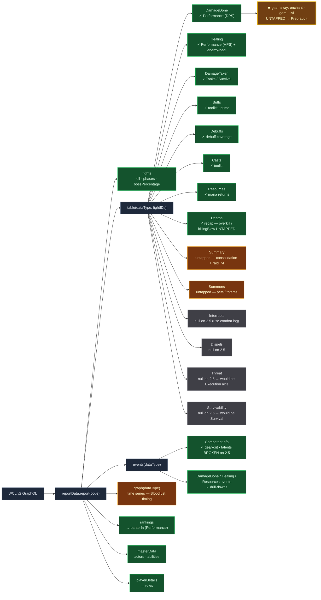

# WCL v2 API surface — what we have access to (live recon)

**Purpose.** A map of *everything* the WCL v2 GraphQL API exposes for our reports, surveyed live
against report `J4Ba1j6VAPDmqCFp` (2026-06-11), and graded against the Raider-Score framework. We had
built only the queries our planned pillars needed; this is the systematic sweep of the edges.

**Method.** Ran `table(dataType: X)` for every `X`, then deep-probed the high-value returns. "Live"
= confirmed returning real data on the 2.5 Anniversary client.

---

## Visual map

Green = we use it · Amber = available, untapped · Grey = null/broken on the 2.5 client · Gold = the standout find.



---

## table() dataType sweep — all return a shape, but content varies

| dataType | Returns | We use it? | Untapped value |
|---|---|---|---|
| **Summary** | totalTime, **itemLevel**, **composition**, damageDone, healingDone, damageTaken, deathEvents, playerDetails | ✗ | One-query overview — consolidation/efficiency; raid avg ilvl |
| **Buffs** | auras[] (uptime/bands) | ✓ (toolkit uptimes) | — |
| **Casts** | entries[] incl. **gear, talents**, abilities, targets | ✓ (toolkit) | gear/talents ride along |
| **DamageDone** | entries[] incl. **gear[], talents[]**, abilities, targets | ✓ (DPS) | **GEAR = enchant/gem/ilvl audit (see below)** |
| **DamageTaken** | entries[] incl. sources, overheal, abilities | ✓ (tanks) | per-source breakdown for non-tanks |
| **Deaths** | entries[] incl. **overkill, killingBlow, deathWindow, events** | ✓ (recap) | overkill / killingBlow depth for Survival |
| **Debuffs** | auras[] (uptime/bands) | ✓ (debuff coverage) | — |
| **Healing** | entries[] incl. overheal, abilities, targets | ✓ (healers) | enemy-healing (proved MS value) |
| **Resources** | resources[] | ✓ (mana returns) | self-sustain view |
| **Summons** | entries[] (pets/totems) | ✗ | pet/totem uptime |
| **Dispels** | entries (nested) — **returned null via table()** | ✗ | needs events() or unavailable on 2.5 |
| **Interrupts** | entries (nested) — **returned null via table()** | ✗ (combat-log instead) | needs events() or unavailable on 2.5 |
| **Threat** | threat — **returned null via table()** | ✗ | needs events()/sourceID or unavailable on 2.5 |
| **Survivability** | players/fights/actortotals — **returned null** | ✗ | WCL's own survival metric; may be unavailable on 2.5 |

---

## ★ The big untapped vein: GEAR (enchants + gems + item level)

`DamageDone`/`Casts` entries carry a full **`gear[]`** array per raider — live-confirmed rich:

```json
{ "id": 32461, "slot": 0, "quality": 4, "name": "Furious Gizmatic Goggles", "itemLevel": 127,
  "permanentEnchant": 3003, "permanentEnchantName": "+5 Attack Power and +5 Critical Strike",
  "gems": [ {"id": 32409, "itemLevel": 70, ...}, {"id": 24054, ...} ] }
```

Per raider we can read **every item**, its **enchant** (id + name, or absent), its **gems** (ids), and
**item level**. This is a premier "tryhard prep" signal we don't capture at all today:
- **Enchant compliance** — which enchantable slots are missing an enchant (direct: `permanentEnchant`
  present or not; needs a whitelist of enchantable slots — head/shoulder/chest/cloak/wrist/hands/legs/
  feet/weapon/rings-if-enchanter).
- **Gem compliance / empty sockets** — `gems[]` present per item; *empty-socket* detection needs the
  item's socket count (from item data / our `cache/<item_id>.json`), since the entry only lists filled
  gems. Quick gem stat lookup reuses the existing item cache.
- **Item level** — per-item + raider average; surfaces an un-upgraded slot.

**→ Feeds the Prep pillar** (today only consumables). "Fully enchanted + gemmed + geared" is exactly
the preparation signal the tool was built to surface. **Highest-value find of the recon.**

---

## Confirmed negatives / dead ends

- **Talents are broken on the 2.5 Anniversary client.** The `talents[]` field parses to garbage
  ("Teleport Westfall", "UseDatabaseForName", "Unknown Ability"; `specID 0` from CombatantInfo). So
  **talent-gated tracking is genuinely infeasible** — this is the final word on the Blood Frenzy
  question: we cannot detect who's BF-specced from WCL. Don't retry talents.
- **`table()` null ≠ unavailable — `events()` recovers half of them (probed 2026-06-11):**
  - **Interrupts → `events()` WORKS** (table null, but the events query is valid; returned 0 on Vashj
    because few raid-relevant casts there). So **WCL-durable interrupts ARE viable** — aggregate
    `events(dataType:Interrupts)` across fights. (Resolves roadmap #7's interrupt upgrade: real path.)
  - **Dispels → `events()` WORKS** — 10 events with full `{sourceID, targetID, abilityGameID,
    extraAbilityGameID (the removed aura), isBuff}`. A real **who-dispelled-what Utility/glue signal**.
  - **Summons → `events()` WORKS** — pet/totem summon events.
  - **Threat → no usable metric.** `events(dataType:Threat)` returns cast/melee events but carries **no
    threat values** — TBC combat logs don't emit threat, so WCL can't compute a threat table. Dead for
    our purposes (no per-player threat number to rank). *Not* a dormant-edition toggle — the source data
    simply doesn't exist in 2.5 logs.
  - **Survivability → unavailable on 2.5** (null table, no event type) — a retail-only computed metric.
    **This one matches the "dormant for another edition" hypothesis.**
  Net: Interrupts + Dispels are real WCL-durable wins via `events()`; Threat/Survivability are genuinely
  out for TBC.

## Depth upgrades (cheap, additive)
- **Deaths**: `overkill` (how hard the killing blow over-killed) + `killingBlow` (what ability) →
  Survival detail ("died to a 9k Spout overkill" vs "slow bleed-out").
- **Summary**: one query for composition + raid avg item level → cheap raid-readiness header.
- **Summons**: pet/totem uptime if a pet-class signal is ever wanted.

---

## Recommendation
The standout is the **gear enchant/gem/ilvl Prep audit** — fully available, zero new query type
(rides on the DamageDone fetch we already run), and it fills the biggest gap in the Prep pillar.
Build that first. Threat/Survivability are tempting but returned empty on 2.5 — gate any plan on a
follow-up `events()` probe confirming they exist on this client.

> Source: live recon vs report `J4Ba1j6VAPDmqCFp`. Re-confirm field availability if WCL changes the
> 2.5 schema. Companion to `docs/TBC_RAID_MECHANICS.md`.
