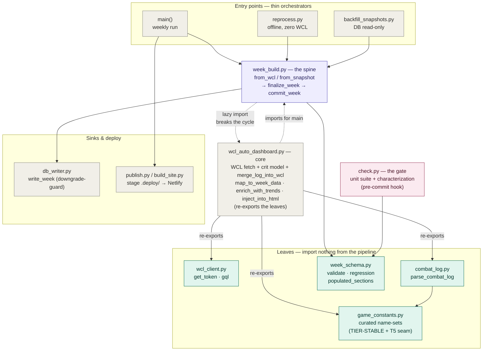
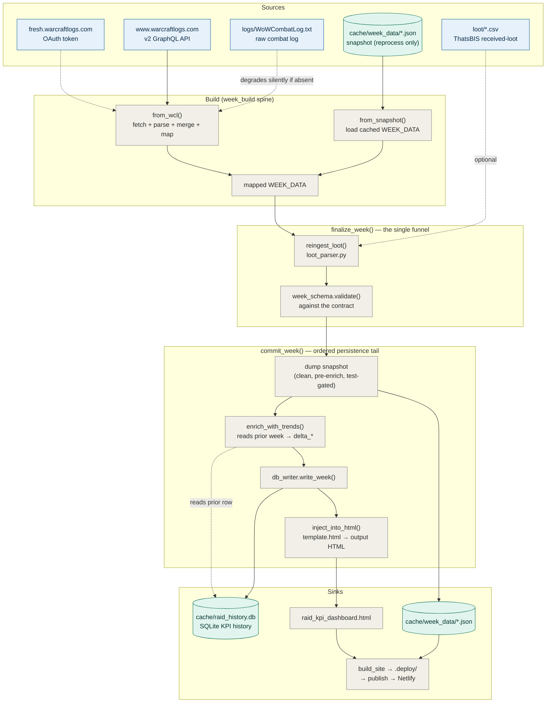

# Architecture

The weekly raid-analytics pipeline for TBC Anniversary 25-man content (SSC + TK). One
maintainer runs `run_weekly.bat`, enters a WCL report code, and the pipeline pulls fight
data, parses the combat log, computes KPIs, injects them into the dashboard HTML, and
deploys to Netlify.

The design collapses three formerly-drifted producers (weekly run, backfill, offline
reprocess) onto **one producer spine** (`week_build.py`), validated against **one contract**
(`week_schema.py`), guarded by **one offline gate** (`check.py`). Everything else is either a
**leaf** (imports nothing from the pipeline) or a thin orchestrator/sink.

---

## 1. Module map

How the modules layer by import direction and role. Leaves at the bottom depend on nothing in
the pipeline; arrows point from importer to imported (calls flow the other way).

**Legend** — purple: spine · green: leaves · pink: gate · grey: orchestrators/core/sinks.
The core and the spine import each other; the spine's `import wcl_auto_dashboard` is **lazy
(inside functions)** to break the cycle, since the core imports the spine for `main()`.

---

## 2. Data flow — one week

**Legend** — blue: external sources · green: persisted data stores · grey: pipeline steps.
Solid arrows are the always-run path; dashed arrows are additive/optional inputs that degrade
silently when absent (OAuth token bootstrap, combat log, loot CSV, the prior-row read).

---

## Load-bearing invariants

- **WCL is the source of record; the combat log is additive enrichment.** Every KPI has a
  WCL-sourced headline that runs every week. A missing log thins a section (drill-downs, HP
  timelines, attribution) but never blanks it — every log read is guarded, which is why
  `LOG -.-> from_wcl` is dashed.
- **One finalize funnel.** `from_wcl` (live) and `from_snapshot` (offline) both hand a mapped
  `WEEK_DATA` to `finalize_week`, which owns the single loot-ingestion point (`reingest_loot`)
  and validates against `week_schema`. Producers can't drift on loot or skip validation — the
  structural fix for the loot-drop / role-drift / order-skew bug class.
- **`commit_week` encodes the persistence order, and it is not reorderable:** dump the clean
  snapshot (pre-enrich) → `enrich_with_trends` (reads the *prior* week's DB row for `delta_*`) →
  `write_week` (whose `INSERT OR REPLACE` would otherwise clobber that prior row) → render.
- **Backfill is DB-read-only.** It calls `finalize_week` + the snapshot dump but *not*
  `commit_week`, so it never overwrites log-complete rows with thinner WCL-only data.
- **The snapshot dump is test-gated.** `--test-db` never pollutes the canonical
  `cache/week_data/` cache.
- **The gate is offline.** `check.py` runs the unit suite plus a characterization test — does
  any prod snapshot silently drop a populated `WEEK_DATA` section vs the recorded golden? — with
  zero WCL/DB access, and the pre-commit hook blocks commits on failure.

## Multi-week viewing

The pipeline embeds only the **latest** week in `const WEEK_DATA`. `build_site.py` stages
`.deploy/index.html` (latest, verbatim) plus `.deploy/weeks/<report>.json` for earlier weeks
(each enriched with its own `delta_*` vs the week before it) and a `WEEKS_INDEX` manifest. The
header date pill becomes a dropdown; `loadWeek(report)` fetches a past week's JSON and mutates
`WEEK_DATA` in place, then re-renders — so the dashboard shows each week *as it was*.
