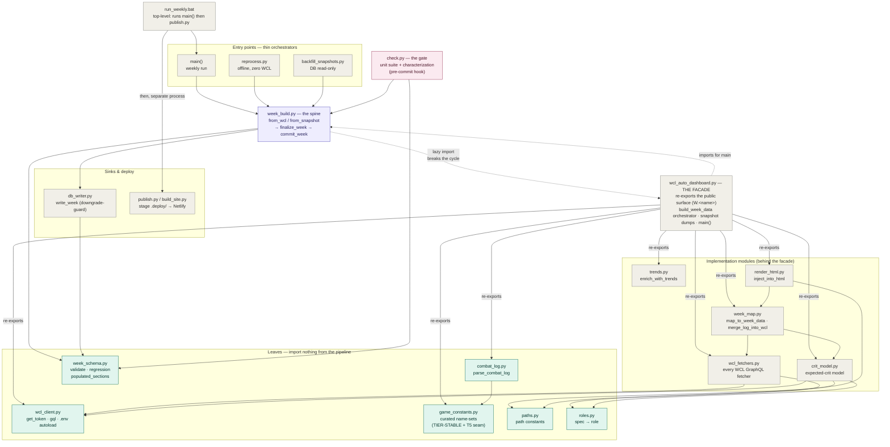
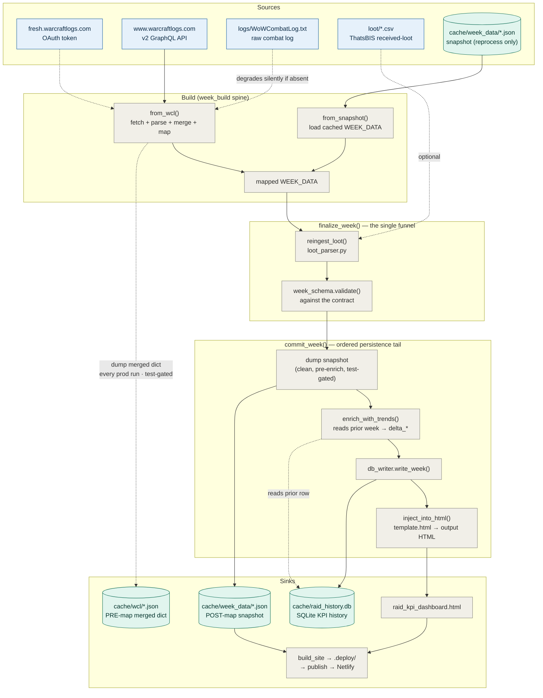
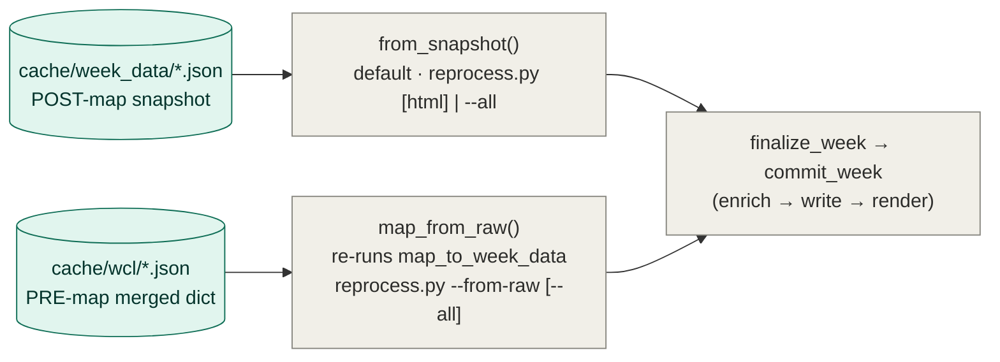

# Architecture

The weekly raid-analytics pipeline for TBC Anniversary 25-man content (SSC + TK). One
maintainer runs `run_weekly.bat`, enters a WCL report code, and the pipeline pulls fight
data, parses the combat log, computes KPIs, injects them into the dashboard HTML, and
deploys to Netlify. A GitHub Actions **run button** mirrors the whole flow in the cloud for
weeks nobody can run locally (see *Operator runs — local & cloud* at the end).

The design collapses three formerly-drifted producers (weekly run, backfill, offline
reprocess) onto **one producer spine** (`week_build.py`), validated against **one contract**
(`week_schema.py`), guarded by **one offline gate** (`check.py`). Everything else is either a
**leaf** (imports nothing from the pipeline) or a thin orchestrator/sink.

---

## 1. Module map

How the modules layer by import direction and role. Leaves at the bottom depend on nothing in
the pipeline; arrows point from importer to imported (calls flow the other way).

**Legend** — purple: spine · green: leaves · pink: gate · grey: orchestrators/facade/sinks.
The facade and the spine import each other; the spine's `import wcl_auto_dashboard` is **lazy
(inside functions)** to break the cycle, since the facade imports the spine for `main()`.
**Facade rule (2026-06-12 decomposition):** every consumer keeps importing
`wcl_auto_dashboard as W` — the implementation modules behind it (`wcl_fetchers`, `week_map`,
`crit_model`, `trends`, `render_html`) are re-exported, and **no module behind the facade ever
imports `wcl_auto_dashboard` or `week_build`** (cycles impossible by construction).
`tests/test_facade_surface.py` freezes the W.<name> surface.
`run_weekly.bat` runs `main()` and then `publish.py` as **two separate processes** — publish
reads the HTML `main()` wrote, it isn't called from `main()`. The gate and `db_writer` both
depend on the `week_schema` contract (characterization / downgrade-guard).

---

## 2. Data flow — one week

**Legend** — blue: external sources · green: persisted data stores · grey: pipeline steps.
Solid arrows are the always-run path; dashed arrows are additive/optional inputs that degrade
silently when absent (OAuth token bootstrap, combat log, loot CSV, the prior-row read).

---

## 3. Offline reprocess — two source tiers

Every prod run dumps **two** snapshots (both test-gated), so a schema / render / metric change can be
rebuilt across past weeks with **zero WCL**. They differ by *where in the pipeline they freeze* — and
therefore by what a reprocess can recover.

- **`cache/week_data` (post-map)** — `reprocess.py [<html>] | --all` replays the FROZEN mapped
  `WEEK_DATA`. Recovers new DB columns/tables, new trends, and render/template changes. It can **not**
  add a field that `map_to_week_data` newly *computes* — the snapshot predates it.
- **`cache/wcl` (pre-map)** — `reprocess.py --from-raw <code> | --from-raw --all` RE-RUNS
  `map_to_week_data` on the merged `wcl` dict, so a **new map-derived metric repopulates offline too**.
  Only a brand-new WCL *query* (a new `fetch_*`) still needs one live run. The merged dict is JSON-safe
  by construction (every `set`→sorted list, `defaultdict`→dict at build time) and `map` reads no
  int-keyed dict, so the round-trip is safe — a defensive `fight_durs` int-key rehydrate future-proofs a
  later map edit.

Run `--all` **oldest-first** after a schema change (it sorts by `meta.start_ms`): a trend delta reads the
prior week's DB row, so the predecessor must be rewritten with the new schema first. The cache fills
*going forward*; weeks raided before a tier shipped are reseeded via `backfill_snapshots.py` or a live run.

---

## Load-bearing invariants

- **WCL is the source of record; the combat log is additive enrichment.** Every KPI has a
  WCL-sourced headline that runs every week. A missing log thins a section (drill-downs, HP
  timelines, attribution) but never blanks it — every log read is guarded, which is why
  `LOG -.-> from_wcl` is dashed.
- **One finalize funnel.** `from_wcl` (live) and `from_snapshot` (offline) both hand a mapped
  `WEEK_DATA` to `finalize_week`, which owns the single loot-ingestion point (`reingest_loot`)
  and validates against `week_schema`. Producers can't drift on loot or skip validation — the
  structural fix for the loot-drop / role-drift / order-skew bug class.
- **`commit_week` encodes the persistence order, and it is not reorderable:** dump the clean
  snapshot (pre-enrich) → `enrich_with_trends` (reads the *prior* week's DB row for `delta_*`) →
  `write_week` (whose `INSERT OR REPLACE` would otherwise clobber that prior row) → render.
- **Backfill is DB-read-only.** It calls `finalize_week` + the snapshot dump but *not*
  `commit_week`, so it never overwrites log-complete rows with thinner WCL-only data.
- **Both snapshot dumps are test-gated.** `--test-db` never pollutes the canonical `cache/week_data/`
  (post-map) or `cache/wcl/` (pre-map, the `--from-raw` source) caches.
- **The gate is offline.** `check.py` runs the unit suite plus a characterization test — does
  any prod snapshot silently drop a populated `WEEK_DATA` section vs the recorded golden? — with
  zero WCL/DB access, and the pre-commit hook blocks commits on failure.

## Multi-week viewing

The pipeline embeds only the **latest** week in `const WEEK_DATA`. `build_site.py` stages
`.deploy/index.html` (latest, verbatim) plus `.deploy/weeks/<report>.json` for earlier weeks
(each enriched with its own `delta_*` vs the week before it) and a `WEEKS_INDEX` manifest. The
header date pill becomes a dropdown; `loadWeek(report)` fetches a past week's JSON and mutates
`WEEK_DATA` in place, then re-renders — so the dashboard shows each week *as it was*.

---

## Operator runs — local & cloud

Two interchangeable ways to run a week, sharing one canonical state (added 2026-06-12).
The operator-facing walkthrough (decision tree, sequence diagrams, guard semantics,
degraded modes) is [operator_flow.md](operator_flow.md); this section is the design summary.

### Local (`run_weekly.bat`)

- **Combat log auto-discovery** (`log_discovery.py`): with `WOW_LOG_DIR` in `.env`, the run
  reads the log straight from the game's `Logs\` dir — each `WoWCombatLog*` candidate's
  first/last timestamps are sniffed cheaply (head+tail 64 KB) and converted onto the report's
  epoch-ms window; the file covering ≥ 70 % of the window wins, so an alt session's log can't
  be picked by accident. Precedence: explicit `--log` > `WOW_LOG_DIR` match > newest in
  `logs/`. After a successful prod run the consumed `.txt` is **zip → verify → moved** to
  `logs/archive/` (never plain-deleted; `combat_log._open_log` reads the archives directly,
  so `backfill_snapshots --log <zip>` replays them).
- **Netlify deploy is a direct REST call** (`publish.py`): zip `.deploy/` → `POST
  /api/v1/sites/{id}/deploys` (bearer `NETLIFY_AUTH_TOKEN`) → poll to `ready`. No
  Node/netlify-cli anywhere. The section-loss deploy guard wraps it unchanged.

### Cloud (`.github/workflows/weekly.yml` — the run button)

Actions tab → *Weekly pipeline* → paste the report code. Steps: restore state from the
**`data` branch** → fetch the **Dropbox drop folder** (`tools/dropbox_drops.py`) → run the
pipeline → publish → push state back → sweep consumed drops to `/processed/`.

- **State**: the orphan `data` branch is the one place the repo carries real raid data
  (accepted exception) — `raid_history.db` (trends need the prior week's rows),
  `cache/week_data/` (the rolling 6-week site), `cache/wcl/` (offline reprocess),
  `last_deploy.json` (the deploy guard's baseline), item caches. Pushed only on success, so
  the branch always holds the last *good* state.
- **Inputs**: drag the **zipped log + loot CSV** into the Dropbox app folder and the cloud
  week is full-fat — the zip lands in `drops/` (the workflow points `WOW_LOG_DIR` there, so
  the same window-matcher applies; stale drops score ~0), the CSV lands in `loot/` (newest
  auto-pick + raid-date filter). Nothing dropped ⇒ the run degrades to log-less (every KPI
  keeps its WCL headline) and the Loot tab hides.
- **Sync**: local and cloud share state via `tools/sync_state.py pull|push` (temp git
  worktree; same allowlist as the workflow). pull/push record the synced `origin/data` commit
  in `cache/.data_branch_sync`; `sync_state.py check` exits 1 when the branch has moved past
  it, and **`run_weekly.bat` runs that check first** — a cloud week that was never pulled
  can't silently corrupt the local trend chain (offline ⇒ the check passes, raid night is
  never blocked).
- The pre-commit hook skips worktrees without `scripts/check.py` (the data branch carries no
  code — there is nothing to gate there).
