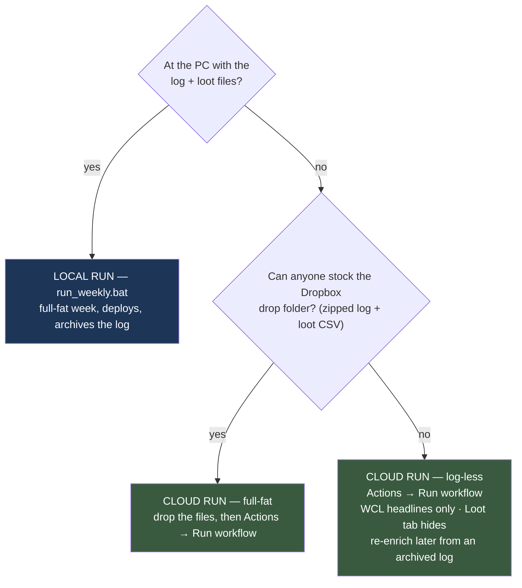
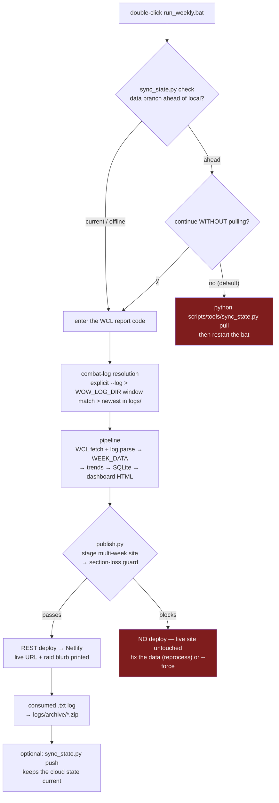
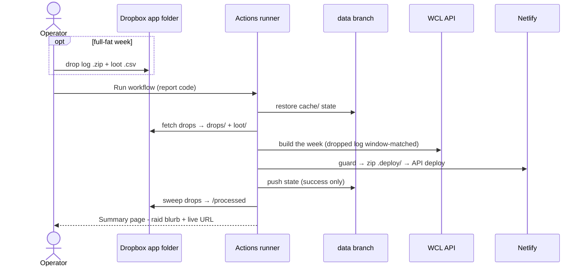
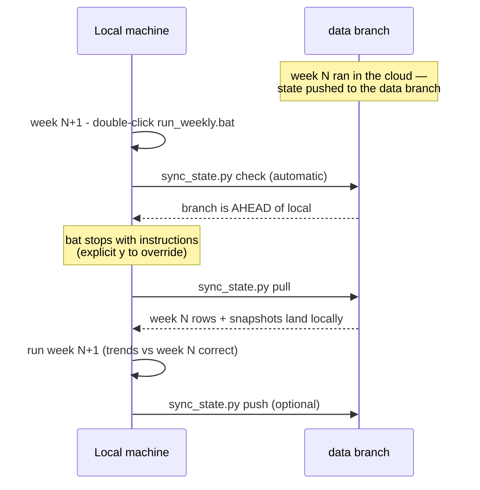

# Operator & Deploy Flow

How a raid week becomes a deployed dashboard — the two run paths, the shared state model,
and what happens when something is missing. Module-level design lives in
[architecture.md](architecture.md); one-time setup commands live in the
[README](../README.md) (Netlify, `WOW_LOG_DIR`, Dropbox, repo secrets).

---

## 1. Which path this week?

Rule of thumb: **run where the files are.** The cloud button exists for weeks the usual
machine isn't available; when it is, the local run is both easier and complete.

---

## 2. Local weekly run (`run_weekly.bat`)

- **Log resolution** (`log_discovery.py`): with `WOW_LOG_DIR` set in `.env`, each
  `WoWCombatLog*` file's first/last timestamps are sniffed (head+tail 64 KB — no full read)
  and scored against the report's time window; ≥ 70 % overlap matches, so an alt session's
  log is never picked by accident. No match (or no `WOW_LOG_DIR`) falls back to the newest
  `.txt` in `logs/`.
- **Archival**: after a successful prod run the consumed `.txt` is zipped → verified →
  moved to `logs/archive/WoWCombatLog-YYYYMMDD-<report>.zip`. Never plain-deleted —
  `backfill_snapshots.py --log <zip>` replays the archives directly.
- `--test-db` proof runs never deploy, never archive, never touch prod state.

---

## 3. Cloud run (Actions → *Weekly pipeline*)

- Needs only **repo write access** — secrets stay in repo settings; the operator never
  handles credentials. Two simultaneous runs are serialized (concurrency group).
- **Drop folder** (optional): zip the log (~180 MB → ~18 MB), drag zip + loot CSV into
  `Dropbox/Apps/<app name>/`. The same window-matching applies, so a stale drop is ignored.
  Consumed drops are *moved* to `processed/`, never deleted. Empty folder ⇒ the run is
  log-less: every KPI keeps its WCL headline, the Loot tab hides.
- The copy-paste raid blurb + live URL land on the **run's Summary page** — no digging
  through raw logs.
- A failed run pushes **nothing** — the data branch always holds the last good state.
  `test_mode` does a `--test-db` rehearsal: no deploy, no state push, drops untouched.

---

## 4. State — one canonical home, two runners

All trend math reads the **prior week's DB rows**, and the rolling 6-week site is staged
from the snapshot folder — so local and cloud runs must share one state. That state lives on
the orphan **`data` branch** (`raid_history.db`, `cache/week_data/`, `cache/wcl/`,
`last_deploy.json`, item caches), pushed by the workflow on success and synced locally with
`scripts/tools/sync_state.py pull|push`.

The footgun is running locally *after* a cloud week without pulling — trends would silently
compute against a stale prior week. That's forget-proofed:

`pull`/`push` record the synced `data`-branch commit in `cache/.data_branch_sync`; `check`
compares it against `origin/data`. Offline (or no data branch) the check passes silently —
a no-internet raid night is never blocked.

---

## 5. The section-loss deploy guard

The last line of defense before the live site changes. It compares the staged build against
the **last successful deploy's** WEEK_DATA (`cache/last_deploy.json`):

| Situation | Outcome |
|---|---|
| New week, normal build | Deploys — cross-week section differences are legitimate |
| Required WCL section blank on a killed week | **Blocked** — the pipeline shipped a broken core |
| Same report re-deployed with a section that went empty | **Blocked** — e.g. a log-less cloud rebuild of an already-published log-complete week (this protected the live site during rollout testing) |
| Same report, a field blanked across the board (parse %) | **Blocked** — field-coverage collapse inside a populated section |
| Staged index unreadable | **Blocked**, fail-closed |

`--force` overrides after you've looked. A blocked deploy still prints the raid blurb and
leaves the live site exactly as it was.

---

## 6. Degraded modes & recovery

| Missing | That week shows | Recovery |
|---|---|---|
| Combat log (cloud run, empty drop folder) | All WCL headlines; thin: MC, friendly fire, drums, engineering, consumables-used (Prep caps 7/10), death recaps, tank lowest-HP | `backfill_snapshots.py <code> --log <archived zip>` when the log surfaces, then `sync_state.py push` + redeploy |
| Loot CSV | Loot tab hides | Drop the CSV in `loot/` (or the Dropbox folder) and re-run; loot is date-filtered so a late CSV is safe |
| Netlify secrets/token | Deploy skipped with a notice; HTML still built locally | Configure per README; re-run `publish.py` |
| Dropbox secrets | Cloud run proceeds log-less (fetch no-ops) | Optional feature — configure per README when wanted |
| The whole local machine | Cloud run covers the week end-to-end | `sync_state.py pull` when back (the bat enforces it) |

One operational note: **the combat log only exists where someone ran `/combatlog`.** If the
usual logger is absent, the week is log-thin no matter the tooling — the drop folder just
means *any* raider who logged can supply it (zipped, it fits a Discord DM).
